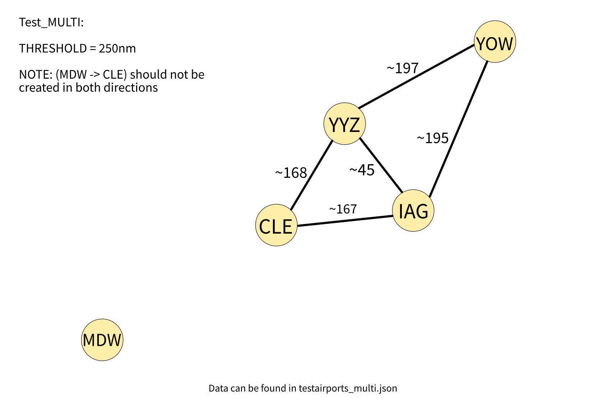

# Flight Path Optimizer

Flight Path Optimizer calculates the shortest route for a limited plane's range using Dijkstra's algorithm. The program fetches airport data from OurAirports API, calculates the great circle distances (orthodromic distance) between all pairs of airports that fit the given needs, and creates a graph with airports as nodes and requirement matching distances as edges, then outputs the shortest path to the destination of choice.

This project uses a modifiable **Threshold** ([see here](#Threshold)) when creating paths representing the realistic range of the aircraft to remove unreachable paths.

For example, while the max range is 650nm, a realistic range for the Cesna 172 is 400nm , so the program will set a 400nm **threshold** which can be modified if needed.

**Change THRESHOLD VARIABLE in flightpathOptimizer.cpp to change the max range** (TO BE CHANGED)

## Features

- Fetches Airport location data from OurAirports api
- parses and filters data using a python script to only include
small, medium, and large airports (no heliports or seaports) and restrict to region of choice
- Calculates the circle distance between all the pairs of airports
using the Haversine formula https://en.wikipedia.org/wiki/Haversine_formula
- Converts calculations into an adjacency list representing a graph with airports as nodes and **Reachable** distances as the edges
- Using Dijkstra's Algorithm (https://en.wikipedia.org/wiki/Dijkstra%27s_algorithm), finds the shortest path from a given starting airport and destination and outputs it to the user

# Threshold
### The Threshold sets the maximum distance (in nautical miles) for creating edges between airports in the network graph. This ensures only direct, feasible routes are included.
### Its purpose is to:
- **Limit Edge Creation:** Only connect airports within the specified distance.
- **Optimize Performance:** Reduce graph density for faster pathfinding.
- **Realistic pathing:** Reflect a realistic route that the specified aircraft range can reach.
### For example if your range is 280nm, a graph from sample data would look like this:

### Whereas if your range is 250nm, the path to reach MDW would no longer be possible, resulting in this graph:

### And if for some reason your range is only 100nm...

## Requirements

- To be added

## Usage

- To be added

